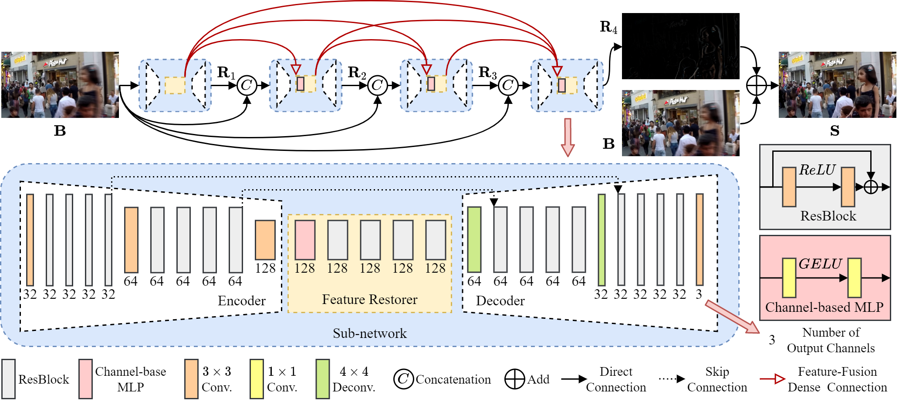

# Multi-Stage Feature-Fusion Dense Network for Motion Deblurring
by Cai Guo, Qian Wang, [Hong-Ning Dai](https://www.henrylab.net), [Ping Li](https://www.comp.polyu.edu.hk/~pinli).

Pytorch Implementation of "Multi-Stage Feature-Fusion Dense Network for Motion Deblurring"


### Results on the GoPro evaluation dataset


### Results on the HIDE evaluation dataset


## Dependencies
python
```
conda create -n mffdnet python=3.8
conda activate mffdnet
```
pytorch
```
conda install pytorch==1.8.0 torchvision==0.9.0 torchaudio==0.8.0 cudatoolkit=11.1 -c pytorch -c conda-forge
```

## Testing
Please enter the "ckpts" folder and then execute the following unzip command to get the pre-trained model "MFFDNet.pth".
```
cat MFFDNet.zip.* > MFFDNet.zip
unzip MFFDNet.zip
```

Please copy test samples into './test_samples'. Then running the following command.
```
python test.py
```

## Citation
If you think this work is useful for your research, please cite the following paper.

```
@article{guo2022multi,
  title={Multi-stage feature-fusion dense network for motion deblurring},
  author={Guo, Cai and Wang, Qian and Dai, Hong-Ning and Li, Ping},
  journal={Journal of Visual Communication and Image Representation},
  volume = {90},
  pages={103717},
  year={2023},
  publisher={Elsevier},
  doi = {https://doi.org/10.1016/j.jvcir.2022.103717}
}
```
